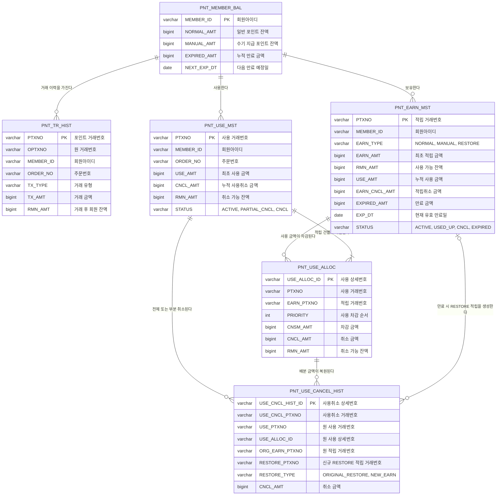

# 무료 포인트 시스템 논리 ERD

이 문서는 무료 포인트 시스템의 핵심 도메인 관계를 간단히 표현한 논리 ERD입니다.
물리 테이블 정의, FK, 인덱스, 제약조건은 `schema.sql`을 기준으로 합니다.

## 관계 설명

| 관계 | 설명 |
|---|---|
| 회원 잔액 - 적립 원장 | 회원별 적립 건과 사용 가능한 잔액을 관리합니다. |
| 회원 잔액 - 사용 원장 | 회원이 주문에서 사용한 포인트와 취소 가능 금액을 관리합니다. |
| 회원 잔액 - 거래 이력 | 적립, 적립취소, 사용, 사용취소, 만료 이력을 Append-Only 방식으로 기록합니다. |
| 적립 원장 - 사용 Allocation | 어떤 적립 건이 어떤 사용 거래에서 얼마만큼 차감되었는지 1원 단위로 추적합니다. |
| 사용 원장 - 사용취소 이력 | 전체 또는 부분 사용취소 결과를 추적합니다. |
| 적립 원장 - 사용취소 이력 | 만료 전에는 원 적립 건을 복원하고, 만료 후에는 신규 RESTORE 적립을 생성합니다. |

## 참고

- `PNT_MEMBER_BAL`과 각 원장 사이의 관계는 `MEMBER_ID` 기반 논리 관계입니다.
- 물리 스키마에서는 원장 간 필수 참조 관계에만 FK를 적용합니다.
- 거래 이력은 원장과 FK로 연결하지 않고 거래번호와 원 거래번호로 추적합니다.
